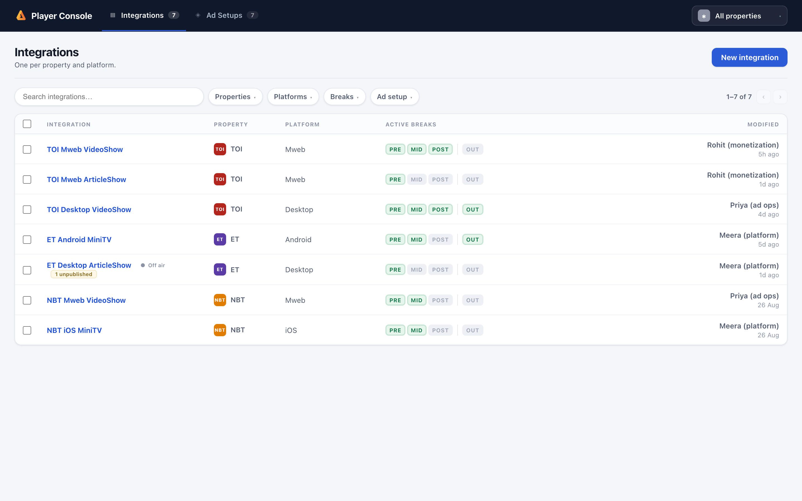
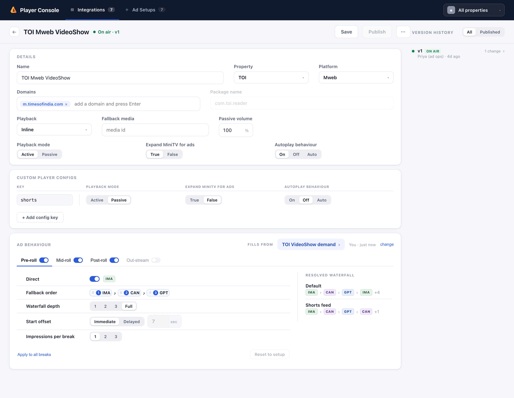
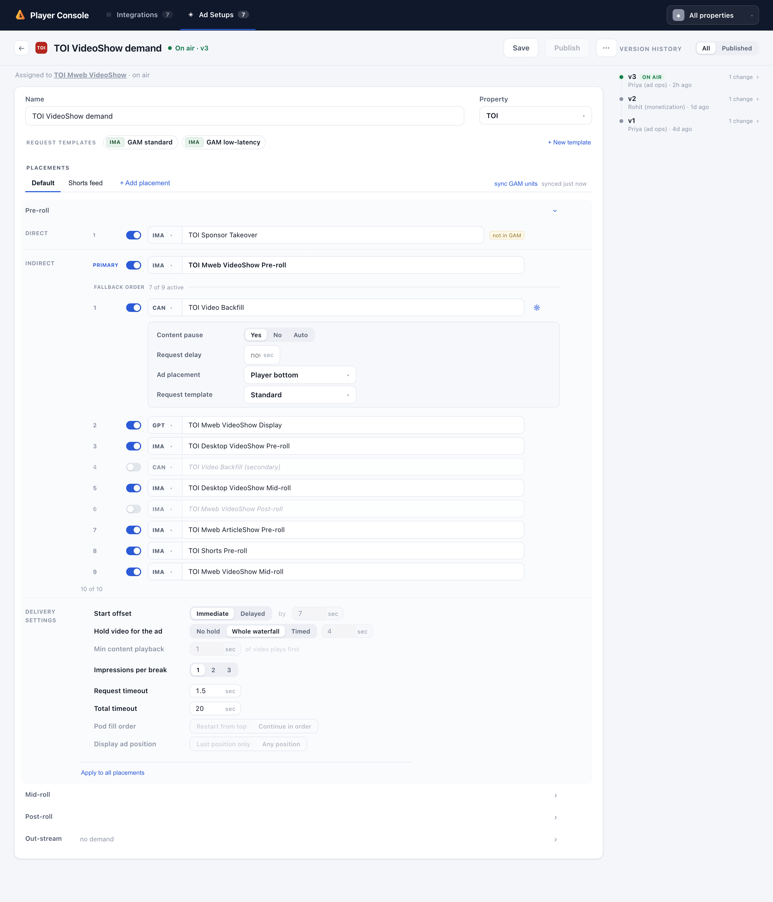
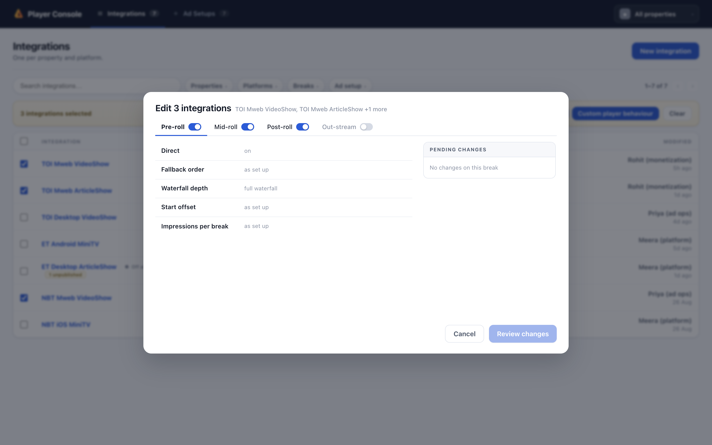
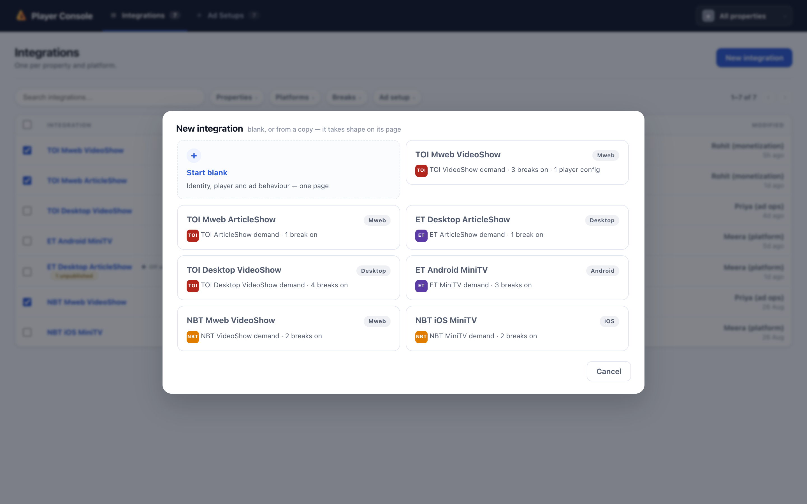

# Player Console — what it is and where its edges are

The Player Console is the self-serve panel for ad delivery inside Slike's video players.
Today this work is spread across GAM screens, config files and requests to engineering;
the console puts it in one place, split into two rooms so two teams can work without
stepping on each other. The **product team** owns Integrations — one per player surface
(TOI Mweb VideoShow, NBT iOS MiniTV), holding the player's identity and behaviour and the
switches that say which ad breaks run. **Ad ops** own Ad Setups — the demand: which ad
units fill each break, in what order, on what schedule.

Everything here runs against an in-memory mock API, so the whole world can be rebuilt in
milliseconds and every number on screen is counted from real state, never estimated. It
is a working prototype of the product, not yet wired to production systems.

## The pieces, and the one promise that ties them

| Piece | Owned by | What it is |
| --- | --- | --- |
| **Integration** | Product | One player surface: name, property, platform, domains or package, the player fields, custom player configs, and per-break switches and quick decisions |
| **Ad setup** | Ad ops | The demand for one integration: placements, each with four breaks (pre-roll, mid-roll, post-roll, out-stream), each break a ladder of ad units |
| **Ad tag** | Ad ops | One ad unit or endpoint: IMA and GPT tags point at GAM ad-unit paths, CAN tags at a URL |
| **Request template** | Ad ops | A named request URL shared account-wide; its macros are a fixed list of five the player fills |
| **Custom player config** | Product | A named fork of the player a page can ask for by key (`shorts`), carrying exactly three facts |

The rule that shapes everything: **one integration asks from exactly one ad setup** — a
surface has one source of demand, never two. The other direction is open (8 Sep): **one ad
setup may fill many integrations**, because the same ladder across mweb, desktop and app
is the ordinary case, and keeping it as a fleet of photocopies means it drifts the first
time anyone tunes one. A shared setup is a *link*: edited once, in one room, it moves
every surface that asks from it — so every door that maps one names who else already
does, and the setup's own page lists them. When a surface wants demand of its very own,
**Copy & use** takes a photocopy — placements, ad units, deals and settings whole — and
tuning that copy never moves the original.

## The integration page

One page holds the whole surface. Details at the top (platform decides what identity is
asked for — web platforms need at least one domain, app platforms a package name; the
other field greys out where it stands). The player's own fields sit inside Details, and
custom configs are a small table underneath — adding one inserts a row with the cursor
already in its key, and the key is held to the same rule the server holds it to: one
word, unique, never "default".

Ad behaviour fills the rest: which setup this surface fills from (a chip that opens the
setup's own editor and brings you back with unsaved edits intact), four break tabs, and
per-break quick decisions — who is asked and in what order, how deep the waterfall goes,
where mid-roll breaks fall, when the pre-roll starts. Every decision is stored as sparse
intent: drop it and the break follows the ad setup again. The right-hand panel shows the
resolved waterfall — the exact walk the player would run, computed the same way the
server computes it.

## The ad setup page

Placements are tabs (the active tab is its own rename field). Each break opens into
zones down a left rail: **Pods** (a mid-roll may run up to three, each owning its own
special deal, ladder and cadence), **Special** (one uncapped deal per break or pod, tried
before everything else), **Ad sources** (the ladder — one primary, up to nine fallbacks,
drag to reorder; the word covers a break's own units and the shared waterfall alike), and
**Delivery settings**. Each ad unit is ONE BLOCK — the unit, its counted fact line and its
settings as three tiers of one soft shape; the caret at the block's end opens and closes
the settings, and so does putting the caret in the unit's field. Every break can be cleared with a
counted confirmation, and the whole setup at once from the ⋯ menu — demand only,
delivery settings stay.

## Editing many surfaces at once

Selecting integrations in the list opens three bulk acts. **Ad behaviour** is a clean
slate: every lever starts closed showing only the cohort's counted today-word ("full
waterfall", "3 different values"); opening one draws the control unset, and only a
deliberate pick queues a change. **Default player behaviour** sets the player's four
facts across the cohort in one step. **Custom player behaviour** walks each selected
integration whole, forks included. Bulk writes are per-integration: a surface the change
cannot apply to is skipped and named, never silently included.

## Creating things

New integrations and new setups start from one chooser: blank, or a photocopy of an
existing one. An integration copy carries the player, its named configs, the switches and
quick decisions, and the setup mapping — a setup someone else holds becomes the copy's
own at the moment of Create, so cancelling leaves nothing behind. A setup copy brings
everything, ad units included. Creation always lands in the real editor, and the one
write is reviewed field by field on the same change-review screen every write ends on.

## Going on air — the publish plane

**Save never changes what viewers see.** Save writes a draft; Publish stamps an
immutable, numbered version and swaps what the player's API serves. History is
append-only — restoring an old version publishes it again as a new one, so every restore
is itself undoable, and the restore dialog names any unpublished draft work it would
overwrite before it does. Taking a surface down is Unpublish, a deliberate act, never a
hidden status field.

Because an integration and its setup publish separately, every publish answers one
question against what is actually live: *would this leave a switched-on break with
nothing published behind it?* Publishing an integration whose break has no live demand is
refused naming each dark break; publishing or unpublishing a setup that would darken a
live surface is refused naming the surface. And belt-and-braces, the served JSON simply
omits any break whose demand is not live.

## The details that bite (read this before building against it)

**Seconds on screen, milliseconds in the store.** The UI never shows milliseconds — every
duration is typed and read in seconds. Exactly two fields are *stored* in milliseconds
because the player's JSON contract wants them that way: `waitMs` (shown as "Hold video
for the ad", served as `maxWait`) and `tagTimeoutMs` ("Request timeout", served as
`timeout`). The conversion happens at one seam on each side of HTTP — `fmtMs` in the web,
`fmtSecs` in the API — and every other numeric field is stored in the unit it displays.

**Time is written two ways.** Cue points and out-stream show times accept plain seconds
("360") or minutes:seconds ("6:00"), up to four hours; the list is deduplicated and
sorted, and a token that isn't a time is refused by name, not dropped. You type 480 and
read it back as 8:00.

**GAM ad units: the directory is a convenience, not a gate.** "Sync GAM units" pulls
newly trafficked units into the console's directory (one directory, one sync — the CTA
lives once, on the setup editor). Searching offers at most 8 directory matches; the rung
lookup shows up to 6 existing tags plus 4 unseen units. A well-formed unit path that
isn't in the directory yet is *accepted* and wears a "not in GAM" mark — a unit
trafficked ten minutes ago is real whether or not our copy caught up — and the mark is
computed fresh on every read, so the next sync clears it by itself. The only hard check
on a hand-typed unit is its shape (`/7176/toi/mweb/videoshow/preroll`: network code,
then path segments), because a stale directory is normal and a malformed path never is.

**Everything refuses by name.** No silent drops: a removed field is refused with where
its answer lives now ("startVolume is gone — the player carries one Passive volume, set
in Details"); a limit names the number found next to the number allowed; anything in use
cannot be deleted, and the refusal names or counts its users. Every refusal is
machine-readable (`status`, `code`, `message`, field-level details), so the UI can put
the reason exactly where the mistake was made.

**The numbers.** At most: 5 placements per setup, 3 mid-roll pods, 10 rungs per ladder
(1 primary + 9 fallbacks), 5 tags in an out-stream rotation, 6 custom configs per
integration, 1 direct deal per break or pod. Names are unique case-insensitively per
object type. Autoplay is On/Off/Auto; Passive volume is 0–100 and is the player's only
volume — a config fork carrying one is refused. Heavy configurations warn with counted
arithmetic ("4 tries × 2.5s is a 10s wait before anything plays") but never block a save
— warnings are levers, refusals are walls, and the difference is deliberate.

**The mock world is deterministic.** Reset rebuilds the same integrations with the same
ids and the same seeded key strings, so counted history never shifts underneath a demo
or a test.

## Known rough edges (found in review, left as-is on purpose)

Small, documented honestly rather than patched quietly: clearing the "Hold video" or
"Request timeout" box reverts silently to the default instead of saying so; an
out-of-range value there is refused in raw milliseconds ("waitMs… got 50") despite the
seconds-only rule; the drive and bulk cue-point editors drop an unparsable token
client-side where the setup editor correctly lets the server refuse it by name; and the
Unpublish endpoint has no button in the UI yet — Delete is gated on it, so a live
integration currently cannot be taken down from the screen. Each is a one-line fix;
none changes scope.

## Where the code lives

`api/` is the model behind an Express server (port 4200): `store/` holds eight subject
modules behind a re-export façade, `mock/` holds every invented fixture. `web/` is a
no-build vanilla-JS app: plain scripts in dependency order, styles split across ten
cascade-ordered files. `test/run.js` pins 117 rules over real HTTP in about a second,
and the repo carries a 44-check browser UAT. The deeper design record — every decision
and the reasoning behind it — is `README.md`; the store split's method is
`docs/STORE-SPLIT.md`.
